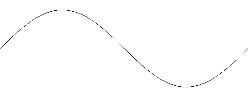
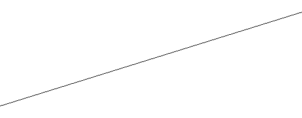
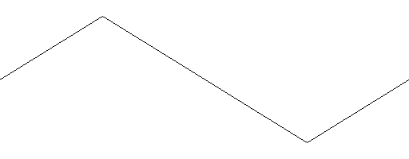
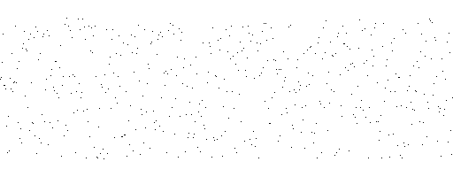
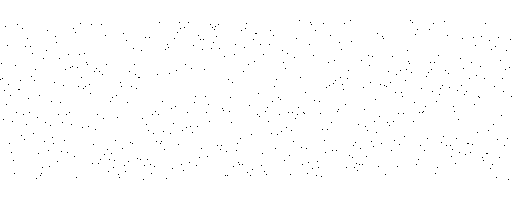

# Uiua Wavetable Editor

### [Try online in Uiua pad](https://uiua.org/pad?src=0_13_0-dev_2__IyBFeHBlcmltZW50YWwhCiMgVWl1YSAwLjEzLjAtZGV2LjIKfiAiZ2l0OiBnaXRodWIuY29tL2FzaHRyYXlwZXR0aW5nem9vL3VpdWEtd2F2ZXRhYmxlcyIKICB-IEFNIENudiBEd24gRk0gSFAgSFBFIEhQUCBIUFMgSFBXIEh3ZiBMUCBMUEUgTFBQIExQUyBMUFcgUGhyIFJNIFRDbWIgVENtZiBUQ3RtIFRDdHAgVE1heAogIH4gQW1wIEF2ZyBCaXQgQ2xwIENscyBDcnMgQ3RtIEN0cCBGYWQgRmxkIEZ1eiBJbnYgTWF4IE1pciBQaHMgUmN0IFJldiBTYXQgU2hmIFNsYyBTcGQgU3BsIFN0ciBTdW0gV3JwIFplcgogIH4gRG9SYW5kb23igLwgRG9SYW5kb23igLwhIERvUmFuZG9t4oC84oC8IFJlcGVhdCEKICB-IEV4cG9ydCBHcmFwaCBHcmFwaEltcHVsc2UgR3JhcGhTcGVjdHJ1bSBHcmFwaFNwZWN0cnVtRnVsbCBJbWFnZSBJbWFnZVRvVGFibGUKICB-IElIUEUgSUhQUCBJSFBTIElIUFcgSUlkIElMUEUgSUxQUCBJTFBTIElMUFcgSVBocwogIH4gSW1wb3J0SW1hZ2UgSW1wb3J0VGFibGUgSW1wb3J0V2F2ZSBOTCBQcmludCBQcmludEwgVGFibGVBdmVyYWdlIFRhYmxlSW5kZXggVGVzdAogIH4gTnN0IE5zdyBQdWwgU2F3IFNpbCBTaW4gU3FyIFRyaQogIH4gVmFsIFZhbFBJIFZhbFBPCgojIEV4YW1wbGUgY29kZQpUZXN0IFNpbjEK)

Utilities for generating & editing single-cycle waveforms & wavetables in Uiua. 

- Runs on version 0.13.0-dev.2 of Uiua
- Imports 16-bit audio files as waveforms or 256-waveform tables
- Imports image files (converted to greyscale & stretched to 2048x256)
- Exports waveforms as 2048-sample, 44100hz, 16-bit .wav files
- Exports 256-waveform tables as 524288-sample, 44100hz, 16-bit .wav files
- Exports wavetable images as 2048x256 .png files (compatible with Serum)
- Exports waveform/table graphs & spectrum graphs as .png or .gif files

### Running online

1. Click the above link to open the Uiua pad.
2. Replace the code starting at the `# Example code` line.
3. Press **Run** in the bottom right or Ctrl+Enter.

*Notes:*

- Some functionality may exceed the default execution limit. This can be raised by clicking the **Show settings** gear in the top right (below the toolbar) and changing the **Exec limit** field.
- Some file-reading functionality (**ImportImage**, **ImportWave**, **ImportTable**) can be used in the online pad by dragging files into the web browser, e.g. dragging "my_wave.wav" into the web browser and running `Graph ImportWave "my_wave.wav"`.
- Some functions, such as writing files, do not work in the online editor. However, audio or images displayed in the editor via **Export**, **Graph**, **Image**, etc. can be saved by right clicking -> "Save As".

### Running on desktop

1. Install [Rust](https://www.rust-lang.org/tools/install) (>=1.78).
2. Run `cargo install --git https://github.com/uiua-lang/uiua uiua -F audio` in your command prompt/terminal.
3. [Download & extract this repository](https://github.com/ashtraypettingzoo/uiua-wavetables/archive/refs/heads/main.zip)
4. Modify **main.ua**, replacing the code starting at the `# Example code` line, making sure to leave the `Exit` call at the bottom.
5. Open the folder in your command prompt/terminal and run `uiua`
6. Press Ctrl+C to stop execution

[Full details on Uiua installation here](https://www.uiua.org/install)

### Uiua basics

Uiua is an array-oriented, stack-based programming language. You should be able to use this library without worrying much about how it works beyond a few basic points, but [the Uiua documentation, tour, & tutorial](https://www.uiua.org/docs) cover anything not mentioned here.

- With few exceptions, Uiua executes top-to-bottom, right-to-left. Functions take the results of the code to the right as inputs; for example, if `Sin 1` generates a sine wave, `Graph Sin 1` graphs that sine wave.
- Unlike many other languages, there is no special syntax for function calls. This means something like `Pul(1, 0.5)` in another langague looks like `Pul 1 0.5`
  - The documentation below lists arguments (inputs) left-to-right. For example, **Pul [Harmonic, Duty]** can be called with `Pul 1 0.5`, where 1 is the Harmonic and 0.5 is the Duty.
- Parentheses can be added for clarity, but are usually optional. `Graph (Sin 1)` is the same as `Graph Sin 1`.
- Spaces are optional, except when seperating names or numbers. `Sin1` is the same as `Sin 1`, but `Pul10.5` is different from `Pul1 0.5` and `InvSin1` is different from `Inv Sin1`.
- You can assign identifiers (names) with `←`. For example, `MySineWave ← Sin1` on one line, and `Graph MySineWave` on the next line.
  - Identifiers can contain upper/lowercase letters, but no numbers, spaces, dashes, or underscores. However, they can contain subscript numbers, which can be added by typing `__` before them. For example, typing `MySineWave__01 ← Sin1` and then running the Uiua interpreter will convert this to `MySineWave₀₁ ← Sin1`, which is valid.
- Adding `;;` to the middle of a line and running the interpreter will split the line at that point.

# Documentation

Input/output types:

- **Number**: An integer or decimal number, e.g. `1` or `0.5`.
- **Range**: A range of numbers, e.g. `(Val 1 2)`.
- **Value**: Either a **Number** or **Range**.
- **Wave**: A single-cycle waveform, e.g. `(Sin 1)`.
- **Table**: A 256-waveform table, e.g. `(Nst)` or `(Sin (Val 1 2))`
- **Wave/Table**: Either a **Wave** or **Table**.
- **Image**: Image data, e.g. `(ImportImage "my_image.png")`
- **String**: Text enclosed in quotes, e.g. `"Hello!"` or `"my_file.png"`

## Basic Waveforms

Generators for basic waveforms. If all the arguments are numbers (e.g. `Pul 1 0.5`), the output is a single waveform. If any of the arguments are a range (e.g. `Pul 1 (Val 0 1)`), the output is a table of waveforms.

### Sin [Harmonic]

<small>Example: `Graph Amp 0.8 Sin 1`</small>

Generates a sine wave.

*Arguments:*

- *Harmonic* (**Value**): Wave frequency

*Output*: **Wave/Table**

### Saw [Harmonic]

<small>Example: `Graph Amp 0.8 Saw 1`</small>

Generates a saw wave.

*Arguments:*

- *Harmonic* (**Value**): Wave frequency

*Output*: **Wave/Table**

### Tri [Harmonic]

<small>Example: `Graph Amp 0.8 Tri 1`</small>

Generates a triangle wave.

*Arguments:*

- *Harmonic* (**Value**): Wave frequency

*Output*: **Wave/Table**

### Pul [Harmonic, Duty]

<small>Example: `Graph Amp 0.8 Pul 1 0.25`</small>

Generates a pulse wave.

*Arguments:*

- *Harmonic* (**Value**): Wave frequency
- *Duty* (**Value**): Duty cycle, 0-1

*Output*: **Wave/Table**

### Sqr [Harmonic]

<small>Example: `Graph Amp 0.8 Sqr 1`</small>

Generates a square wave (pulse wave with 50% duty cycle).

*Arguments:*

- *Harmonic* (**Value**): Wave frequency

*Output*: **Wave/Table**

### Nsw []

<small>Example: `Graph Amp 0.8 Nsw`</small>

Generates a white noise wave.

*Arguments*: None

*Output*: **Wave/Table**

### Sil []

<small>Example: `Graph Sil`</small>

Generates a silent wave.

*Arguments*: None

*Output*: **Wave/Table**

## Basic Tables

Generators for basic wavetables. Unlike the **Basic Waveforms** listed above, the output is always a table.

### Nst []

<small>Example: `Graph Amp 0.8 Nst`</small>

Generates a white noise table. Unlike **Nsw**, each wave in the table will be unique. 

*Arguments:* None

*Output*: **Table**

