# Uiua Wavetable Tools

Utilities for generating & editing single-cycle waveforms & wavetables in Uiua. 

- Runs on version 0.13.0-dev.2 of Uiua
- Imports 16-bit audio files as waveforms or 256-waveform tables
- Imports image files (converted to greyscale & stretched to 2048x256)
- Exports waveforms as 2048-sample, 44100hz, 16-bit .wav files
- Exports 256-waveform tables as 524288-sample, 44100hz, 16-bit .wav files
- Exports wavetable images as 2048x256 .png files (compatible with Serum)
- Exports waveform/table graphs & spectrum graphs as .png or .gif files

### [Try online in Uiua pad](https://uiua.org/pad?src=0_13_0-dev_2__IyBFeHBlcmltZW50YWwhCiMgVWl1YSAwLjEzLjAtZGV2LjIKfiAiZ2l0OiBnaXRodWIuY29tL2FzaHRyYXlwZXR0aW5nem9vL3VpdWEtd2F2ZXRhYmxlcyIKICB-IEFNIENudiBEd24gRk0gSFAgSFBFIEhQUCBIUFMgSFBXIEh3ZiBMUCBMUEUgTFBQIExQUyBMUFcgUGhyIFJNIFRDbWIgVENtZiBUQ3RtIFRDdHAgVE1heAogIH4gQW1wIEF2ZyBCaXQgQ2xwIENscyBDcnMgQ3RtIEN0cCBGYWQgRmxkIEZ1eiBJbnYgTWF4IE1pciBQaHMgUmN0IFJldiBTYXQgU2hmIFNsYyBTcGQgU3BsIFN0ciBTdW0gV3JwIFplcgogIH4gRG9SYW5kb23igLwgRG9SYW5kb23igLwhIERvUmFuZG9t4oC84oC8IFJlcGVhdCEKICB-IEV4cG9ydCBHcmFwaCBHcmFwaEltcHVsc2UgR3JhcGhTcGVjdHJ1bSBHcmFwaFNwZWN0cnVtRnVsbCBJbWFnZSBJbWFnZVRvVGFibGUKICB-IElIUEUgSUhQUCBJSFBTIElIUFcgSUlkIElMUEUgSUxQUCBJTFBTIElMUFcgSVBocwogIH4gSW1wb3J0SW1hZ2UgSW1wb3J0VGFibGUgSW1wb3J0V2F2ZSBOTCBQcmludCBQcmludEwgVGFibGVBdmVyYWdlIFRhYmxlSW5kZXggVGVzdAogIH4gTnN0IE5zdyBQdWwgU2F3IFNpbCBTaW4gU3FyIFRyaQogIH4gUm5kIFJuZEkKICB-IFZhbCBWYWxQSSBWYWxQTwoKIyBFeGFtcGxlIGNvZGUKV2F2ZeKCgSDihpAgQXZne1NpbjMgQW1wMC43U2luMiBTaW4xfQpXYXZl4oKCIOKGkCBBTTAuNFNpbjcgQU0wLjVTaW4yIFNpbjEKV2F2ZeKCgiDihpAgQXZne1NhdzEgKFB1bCAyIDAuMil9CldhdmXigoQg4oaQIEJpdDAuNyBGTTAuMVNpbjcgU2luMQpUYmzigoEg4oaQIEZNKFZhbCAwIDEpIFNpbjIgU2luMQpUYmzigoIg4oaQIE1heCBBdmd7QW1wKFZhbCAwIDEpU2luMiBTaW4xfQpUYmzigoMg4oaQIEJpdChWYWwgMCAxKSBDcnMoVmFsUEkgMCAxIDIpIFNpbjEgU2luMwoKVHN0IOKGkCBUYmzigoMKVGVzdCBUc3QKR3JhcGggVHN0CkdyYXBoU3BlY3RydW0gVHN0Cg==)

### Running online

1. Click the above link to open the Uiua pad.
2. Replace the code starting at the `# Example code` line.
3. Press **Run** in the bottom right or Ctrl+Enter.

*Notes:*

- Some functionality may exceed the default execution limit. This can be raised by clicking the **Show settings** gear in the top right (below the toolbar) and changing the **Exec limit** field.
- Some file-reading functionality (**ImportImage**, **ImportWave**, **ImportTable**) can be used in the online pad by dragging files into the web browser, e.g. dragging "my_wave.wav" into the web browser and running `Graph ImportWave "my_wave.wav"`.
- Some functions, such as writing files, do not work in the online editor. However, audio or images displayed in the editor via **Export**, **Graph**, **Image**, etc. can be saved by right clicking -> "Save As".

### Running on desktop

1. Install [Rust](https://www.rust-lang.org/tools/install) (>=1.78).
2. Run `cargo install --git https://github.com/uiua-lang/uiua uiua -F audio` in your command prompt/terminal.
3. [Download & extract this repository](https://github.com/ashtraypettingzoo/uiua-wavetables/archive/refs/heads/main.zip)
4. Modify **main.ua**, replacing the code starting at the `# Example code` line, making sure to leave the `Exit` call at the bottom.
5. Open the folder in your command prompt/terminal and run `uiua`
6. Press Ctrl+C to stop execution

[Full details on Uiua installation here](https://www.uiua.org/install)

### Uiua basics

Uiua is an array-oriented, stack-based programming language. You should be able to use this library without worrying much about how it works beyond a few basic points, but [the Uiua documentation, tour, & tutorial](https://www.uiua.org/docs) cover anything not mentioned here.

- With few exceptions, Uiua executes top-to-bottom, right-to-left. Functions take the results of the code to the right as inputs; for example, if `Sin 1` generates a sine wave, `Graph Sin 1` graphs that sine wave.
- Unlike many other languages, there is no special syntax for function calls. This means something like `Pul(1, 0.5)` in another langague looks like `Pul 1 0.5`
  - The documentation below lists arguments (inputs) left-to-right. For example, **Pul [Harmonic, Duty]** can be called with `Pul 1 0.5`, where 1 is the Harmonic and 0.5 is the Duty.
- Parentheses can be added for clarity, but are usually optional. `Graph (Sin 1)` is the same as `Graph Sin 1`.
- Spaces are optional, except when seperating names or numbers. `Sin1` is the same as `Sin 1`, but `Pul10.5` is different from `Pul1 0.5` and `InvSin1` is different from `Inv Sin1`.
- You can assign identifiers (names) with `←`. For example, `MySineWave ← Sin1` on one line, and `Graph MySineWave` on the next line.
  - Identifiers can contain upper/lowercase letters, but no numbers, spaces, dashes, or underscores. However, they can contain subscript numbers, which can be added by typing `__` before them. For example, typing `MySineWave__01 ← Sin1` and then running the Uiua interpreter will convert this to `MySineWave₀₁ ← Sin1`, which is valid.
- Negative numbers use `¯` and not `-`, e.g. `¯1.5` instead of `-1.5`. This symbol can be entered via the web editor toolbar, or by typing `` ` `` (backtick) and running the interpreter.
- Adding `;;` to the middle of a line and running the interpreter will split the line at that point.

# To Do

### Issues

- **Str** has unintended buzzing artifacts.
- **NewName** does not work with subdirectories.

### Features

- Better error reporting
- IR (impulse response) importing
- Value ranges:
  - LFO
  - AD envelope
  - Combining ranges end-to-end
  - Other ease types (e.g. sin, exp, in-out)
- Combining tables end-to-end
- Karplus-Strong synthesis
- Harmor-style harmonizer

# Documentation

Input/output types:

- **Integer**: An integer, e.g. `3`.
- **Number**: An integer or decimal number, e.g. `1` or `0.5`.
- **Range**: A range of numbers, e.g. `(Val 1 2)`.
- **Value**: Either a **Number** or **Range**.
- **Wave**: A single-cycle waveform, e.g. `(Sin 1)`.
- **Table**: A 256-waveform table, e.g. `(Nst)` or `(Sin (Val 1 2))`
- **Wave/Table**: Either a **Wave** or **Table**.
- **Impulse(s)**: An impulse response or table of impulse responses.
- **Image**: Image data, e.g. `(ImportImage "my_image.png")`
- **String**: Text enclosed in quotes, e.g. `"Hello!"` or `"my_file.png"`

## Utilities

Various utilities for writing, reading, & converting waves/tables/images.

### Export [Wave/Table]

Exports & plays a wave or table in a format suitable for reimporting in other tools/plugins. In the web editor, this outputs a .wav file that can be saved with right click -> "Save As". On desktop, this only plays the file in the command prompt/terminal (use **WriteAudio** instead to save a file).

*Arguments*:

- *Wave/Table* (**Wave/Table**): A single-cycle waveform or table of waveforms.

*Output*: None

### Test [Wave/Table]

Plays a pitched-up table or pitched-up and extended wave. Similar to **Export**, but plays in format that is more listenable, but not suitable for reimporting in other tools/plugins.

*Arguments*:

- *Wave/Table* (**Wave/Table**): A single-cycle waveform or table of waveforms.

*Output*: None

### Graph [Wave/Table]

Exports & displays a 512x200 graph of a wave or table. In the web editor, this outputs a .png or .gif file that can be saved with right click -> "Save As". On desktop, this only displays the file in the command prompt/terminal (use **WriteGraph** instead to save a file).

*Arguments*:

- *Wave/Table* (**Wave/Table**): A single-cycle waveform or table of waveforms.

*Output*: None

### GraphSpectrum [Wave/Table]

Exports & displays a 512x200 spectrum graph of a wave or table. In the web editor, this outputs a .png or .gif file that can be saved with right click -> "Save As". On desktop, this only displays the file in the command prompt/terminal (use **WriteSpectrum** instead to save a file).

*Arguments*:

- *Wave/Table* (**Wave/Table**): A single-cycle waveform or table of waveforms.

*Output*: None

### Image [Wave/Table]

Exports & displays a 2048x256 image version of a wave or table in a format suitable for reimporting in other tools/plugins. In the web editor, this outputs a .png file that can be saved with right click -> "Save As". On desktop, this only displays the file in the command prompt/terminal (use **WriteImage** instead to save a file).

*Arguments*:

- *Wave/Table* (**Wave/Table**): A single-cycle waveform or table of waveforms.

*Output*: None

### ImportWave [Filename]

Imports an audio file as a single-cycle waveform. Not compatible with bit depths above 16-bit. The file will be stretched/compressed to 2048 samples. In the web pad, this reads from files dragged into the browser window. On desktop, this reads from the folder **InDirAudio** as specified in *settings.ua* (`/in` by default).

*Arguments*:

- *Filename* (**String**): The name of an audio file, e.g. `"my_wave.wav"`. On desktop, this can include subdirectories, e.g. `"my_folder/my_wave.wav"`

*Output*: **Wave**

### ImportTable [Filename]

Imports an audio file as a 256-waveform table. Not compatible with bit depths above 16-bit. The file will be stretched/compressed to 256 waves at 2048 samples each, or 524288 total samples. In the web pad, this reads from files dragged into the browser window. On desktop, this reads from the folder **InDirAudio** as specified in *settings.ua* (`/in` by default).

*Arguments*:

- *Filename* (**String**): The name of an audio file, e.g. `"my_table.wav"`. On desktop, this can include subdirectories, e.g. `"my_folder/my_table.wav"`

*Output*: **Wave**

### ImportImage [Filename]

Imports an image file. The file will be converted to greyscale and stretched/compressed to 2048x256. In the web pad, this reads from files dragged into the browser window. On desktop, this reads from the folder **InDirImage** as specified in *settings.ua* (`/in` by default). Can be used with *ImageToTable* to import an image as a wavetable, e.g. `ImageToTable ImportImage "my_image.png"`

*Arguments*:

- *Filename* (**String**): The name of an image file, e.g. `"my_image.png"`. On desktop, this can include subdirectories, e.g. `"my_folder/my_image.png"`

*Output*: **Image**

### ImageToTable [Image]

Converts image data to a wavetable. Usually used with *ImportImage* to import an image as a wavetable, e.g. `ImageToTable ImportImage "my_image.png"`

*Arguments*:

- *Image* (**Image**): Image data.

*Output*: **Table**

### WriteAudio (*Desktop Only*) [Name, Wave/Table]

Saves a wave or table to a .wav file in a format suitable for reimporting in other tools/plugins. Saves to the folder **OutDirAudio** as specified in *settings.ua* ("/out" by default). For example, `WriteAudio "my_wave" Sin1` will create or overwrite the file "/out/my_wave.wav" by default.

*Arguments*:

- *Name* (**String**): Name of the file to write (without extension). Can include subdirectories.
- *Wave/Table* (**Wave/Table**): A single-cycle waveform or table of waveforms.

*Output*: None

### WriteImage (*Desktop Only*) [Name, Wave/Table]

Saves a 2048x256 image version of a wave or table to a .png file in a format suitable for reimporting in other tools/plugins. Saves to the folder **OutDirImage** as specified in *settings.ua* ("/out" by default), and appends **OutSuffixImage** as specified in *settings.ua* (nothing by defualt) to the end of the name. For example, `WriteImage "my_wave" Sin1` will create or overwrite the file "/out/my_wave.png" by default.

*Arguments*:

- *Name* (**String**): Name of the file to write (without extension). Can include subdirectories.
- *Wave/Table* (**Wave/Table**): A single-cycle waveform or table of waveforms.

*Output*: None

### WriteGraph (*Desktop Only*) [Name, Wave/Table]

Saves a 512x200 graph of a wave or table to a .png or .gif file in a format suitable for reimporting in other tools/plugins. Saves to the folder **OutDirGraph** as specified in *settings.ua* ("/out" by default), and appends **OutSuffixGraph** as specified in *settings.ua* ("g" by defualt) to the end of the name. For example, `WriteGraph "my_wave" Sin1` will create or overwrite the file "/out/my_waveg.png" by default.

*Arguments*:

- *Name* (**String**): Name of the file to write (without extension). Can include subdirectories.
- *Wave/Table* (**Wave/Table**): A single-cycle waveform or table of waveforms.

*Output*: None

### WriteSpectrum (*Desktop Only*) [Name, Wave/Table]

Saves a 512x200 spectrum graph of a wave or table to a .png or .gif file in a format suitable for reimporting in other tools/plugins. Saves to the folder **OutDirSpectrum** as specified in *settings.ua* ("/out" by default), and appends **OutSuffixSpectrum** as specified in *settings.ua* ("s" by defualt) to the end of the name. For example, `WriteGraph "my_wave" Sin1` will create or overwrite the file "/out/my_waves.png" by default.

*Arguments*:

- *Name* (**String**): Name of the file to write (without extension). Can include subdirectories.
- *Wave/Table* (**Wave/Table**): A single-cycle waveform or table of waveforms.

*Output*: None

### NewName (*Desktop Only*) []

Gets an unused name in the output directories (as specified in *settings.ua*), starting with "00000", then "00001", and so on. Can be used with *WriteAudio*, *WriteImage*, *WriteGraph*, *WriteSpectrum*, and/or *Repeat!* to save waves/tables in batches.

*Arguments*: None

*Output*: **String**

### RandomAudioFile (*Desktop Only*) [Subfolder]

Gets the filename of random .wav file in a subdirectory of **InDirAudio** as specified in *settings.ua* (`/in` by default). Can be used with *ImportWave* or *ImportTable* to import a random wave or table from a file, e.g. `ImportWave RandomAudioFile "my_waves"`.

*Arguments*:
- *Subfolder* (**String**): Subdirectory to pull from.

*Output*: **String**

### RandomImageFile (*Desktop Only*) [Subfolder]

Gets the filename of random .png file in a subdirectory of **InDirImage** as specified in *settings.ua* (`/in` by default). Can be used with *ImportImage* and *ImageToTable* to import a random image from a file as a wavetable, e.g. `ImageToTable ImportImage RandomImageFile "my_images"`.

*Arguments*:
- *Subfolder* (**String**): Subdirectory to pull from.

*Output*: **String**

### TableAverage [Table]

Averages a table into a single-cycle waveform.

*Arguments*:

- *Table* (**Table**): A table of waveforms.

*Output*: **Wave**

### TableIndex [Index, Table]

Gets the waveform at a given index of a table.

*Arguments*:

- *Index* (**Integer**): 0-255, the index of the waveform.
- *Table* (**Table**): A table of waveforms.

*Output*: **Wave**

### Print [String]

Prints a string of text to the command line/terminal or web pad output. Does not include a newline, e.g. `Print "World" Print "Hello"` will print `"HelloWorld"` on one line.

*Arguments*:

- *String* (**String**): A string of text.

*Output*: None

### PrintL [String]

Prints a string of text to the command line/terminal or web pad output. Includes a newline, e.g. `PrintL "World" PrintL "Hello"` will print `"Hello"` on one line and `"World"` on the next.

*Arguments*:

- *String* (**String**): A string of text.

*Output*: None

### NL []

Prints a newline. `NL Print "Hello World"` is equivalent to `PrintL "Hello World"`.

*Arguments*: None.

*Output*: None

### Rnd [Min, Max]

Generates a random number in a given range.

*Arguments*:

- *Min* (**Number**): Minimum number.
- *Max* (**Number**): Maximum number.

*Output*: **Number**

### RndI [Min, Max]

Generates a random integer in a given range.

*Arguments*:

- *Min* (**Integer**): Minimum integer.
- *Max* (**Integer**): Maximum integer.

*Output*: **Integer**

### Repeat! (*Macro*) [Function, Times]

Repeats a (parenthesized) function several times. For example, `Repeat!(Graph Nsw)5` will display five different noise wave graphs.

*Arguments*:

- *Function*: A block of code surrounded in parentheses.
- *Times* (**Integer**): ≥0, number of times to call the given function.

### DoRandom‼ (*Macro*) [Function 1, Function 2]

Calls one of two (parenthesized) functions randomly. For example, `DoRandom‼(Inv)(Rct) Sin1` (or equivalently, `DoRandom‼(Inv|Rct) Sin1`) will randomly return either an inverted sine wave or a rectified sine wave.

*Arguments*:

- *Function 1*: A block of code surrounded in parentheses.
- *Function 2*: A block of code surrounded in parentheses.

### DoRandom‼! (*Macro*) [Function 1, Function 2, Function 3]

Like DoRandom‼, but for 3 functions.

*Arguments*:

- *Function 1*: A block of code surrounded in parentheses.
- *Function 2*: A block of code surrounded in parentheses.
- *Function 3*: A block of code surrounded in parentheses.

### DoRandom‼‼ (*Macro*) [Function 1, Function 2, Function 3, Function 4]

Like DoRandom‼, but for 4 functions.

*Arguments*:

- *Function 1*: A block of code surrounded in parentheses.
- *Function 2*: A block of code surrounded in parentheses.
- *Function 3*: A block of code surrounded in parentheses.
- *Function 4*: A block of code surrounded in parentheses.

## Value Ranges

Generators for number ranges. Can be used to create wavetables where the inputs to waveform operations/generators change over time.

### Val [Start, End]

<small>Example: `Graph Amp(Val 0 1) Sin1`</small>

Generates a range of numbers, starting with one value, and linearly changing to the end value. For example, `Amp(Val 0 1) Sin1` generates a wavetable with a sine wave that gradually increases in volume.

*Arguments:*

- *Start* (**Number**): Start value.
- *End* (**Number**): End value.

*Output*: **Range**

### ValPI [Start, End, Exponent]

<small>Example: `Graph Amp(ValPI 0 1 3) Sin1`</small>

Generates a range of numbers, starting with one value and changing to the end value, with a powered in ease. For example, `Amp(ValPI 0 1 3) Sin1` generates a wavetable with a sine wave that gradually increases in volume, but changes faster at the end than the beginning.

*Arguments:*

- *Start* (**Number**): Start value.
- *End* (**Number**): End value.
- *Exponent* (**Number**): Ease exponent; 2 = quadratic ease, 3 = cubic ease, and so on.

*Output*: **Range**

### ValPO [Start, End, Exponent]

<small>Example: `Graph Amp(ValPO 0 1 3) Sin1`</small>

Generates a range of numbers, starting with one value and changing to the end value, with a powered out ease. For example, `Amp(ValPO 0 1 3) Sin1` generates a wavetable with a sine wave that gradually increases in volume, but changes faster at the beginning than the end.

*Arguments:*

- *Start* (**Number**): Start value.
- *End* (**Number**): End value.
- *Exponent* (**Number**): Ease exponent; 2 = quadratic ease, 3 = cubic ease, and so on.

*Output*: **Range**

## Basic Waveforms

Generators for basic waveforms. If all the arguments are numbers (e.g. `Pul 1 0.5`), the output is a single waveform. If any of the arguments are a range (e.g. `Pul 1 (Val 0 1)`), the output is a table of waveforms.

### Sin [Harmonic]

<small>Example: `Graph Amp 0.8 Sin 1`</small>

Generates a sine wave.

*Arguments:*

- *Harmonic* (**Value**): Wave frequency.

*Output*: **Wave/Table**

### Saw [Harmonic]

<small>Example: `Graph Amp 0.8 Saw 1`</small>

Generates a saw wave.

*Arguments:*

- *Harmonic* (**Value**): Wave frequency.

*Output*: **Wave/Table**

### Tri [Harmonic]

<small>Example: `Graph Amp 0.8 Tri 1`</small>

Generates a triangle wave.

*Arguments:*

- *Harmonic* (**Value**): Wave frequency.

*Output*: **Wave/Table**

### Pul [Harmonic, Duty]

<small>Example: `Graph Amp 0.8 Pul 1 0.25`</small>

Generates a pulse wave.

*Arguments:*

- *Harmonic* (**Value**): Wave frequency.
- *Duty* (**Value**): Duty cycle, 0-1.

*Output*: **Wave/Table**

### Sqr [Harmonic]

<small>Example: `Graph Amp 0.8 Sqr 1`</small>

Generates a square wave (pulse wave with 50% duty cycle).

*Arguments:*

- *Harmonic* (**Value**): Wave frequency.

*Output*: **Wave/Table**

### Nsw []

<small>Example: `Graph Amp 0.8 Nsw`</small>

Generates a white noise wave.

*Arguments*: None.

*Output*: **Wave/Table**

### Sil []

<small>Example: `Graph Sil`</small>

Generates a silent wave.

*Arguments*: None.

*Output*: **Wave/Table**

## Basic Tables

Generators for basic wavetables. Unlike the **Basic Waveforms** listed above, the output is always a table.

### Nst []

<small>Example: `Graph Amp 0.8 Nst`</small>

Generates a white noise table. Unlike **Nsw**, each wave in the table will be unique. 

*Arguments*: None.

*Output*: **Table**

## Wave operations

Operations (effects/transformations) on waveforms & tables. If all **Value** arguments are **Number**s and all **Wave/Table** arguments are **Wave**s, the output is a single waveform. If any of the arguments are a **Range** or **Table**, the output is a table of waveforms.

### Sum [{Waves/Tables}]

<small>Example: `Graph Sum {Amp0.2 Saw1 Amp0.4 Sqr3}`</small>

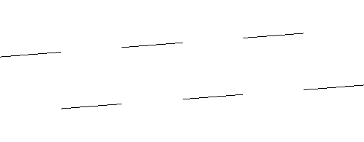

Sum a list of waves/tables.

*Arguments*:

- *{Waves/Tables}* (List of **Wave/Table**s): A list of waves/tables surrounded by curly braces.

*Output*: **Wave/Table**

### Avg [{Waves/Tables}]

<small>Example: `Graph Avg {Sin1 Sin3}`</small>

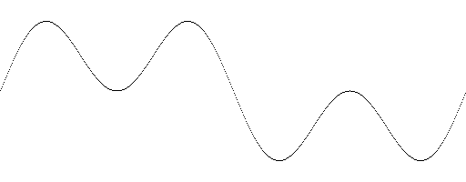

Average a list of waves/tables.

*Arguments*:

- *{Waves/Tables}* (List of **Wave/Table**s): A list of waves/tables surrounded by curly braces.

*Output*: **Wave/Table**

### Amp [Amount, Wave/Table]

<small>Example: `Graph Amp0.3 Sin2`</small>

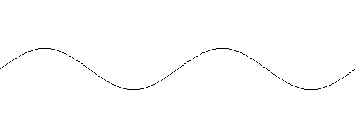

Amplify a wave/table.

*Arguments*:

- *Amount* (**Value**): Amplification; 0 = silence, 1 = no change.
- *Wave/Table* (**Wave/Table**): Input waveform or table of waveforms.

*Output*: **Wave/Table**

### Max [Wave/Table]

<small>Example: `Graph Max Amp0.3 Sin2`</small>

Maximize a wave/table by peaks. Each wave in a table is maximized independently.

*Arguments*:

- *Wave/Table* (**Wave/Table**): Input waveform or table of waveforms.

*Output*: **Wave/Table**

### Ctp [Wave/Table]

<small>Example: `Graph Ctp Rct Sin1`</small>

Center a wave/table by peaks. Each wave in a table is centered independently.

*Arguments*:

- *Wave/Table* (**Wave/Table**): Input waveform or table of waveforms.

*Output*: **Wave/Table**

### Ctm [Wave/Table]

<small>Example: `Graph Ctm Amp0.4 Pul 2 (Val 0 1)`</small>

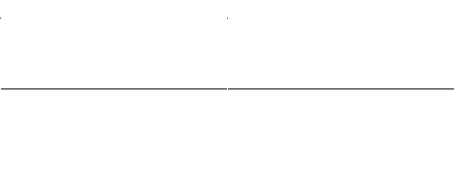

Center a wave/table by mean. Each wave in a table is centered independently.

*Arguments*:

- *Wave/Table* (**Wave/Table**): Input waveform or table of waveforms.

*Output*: **Wave/Table**

### Phs [Amount, Wave/Table]

<small>Example: `Graph Phs0.25 Sin1`</small>

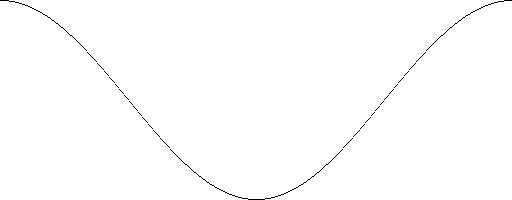

Phase-shift a wave/table.

*Arguments*:

- *Amount* (**Value**): 0-1, Shift amount, 0 = 0° shift, 0.5 = 180° shift, 1 = 360° shift
- *Wave/Table* (**Wave/Table**): Input waveform or table of waveforms.

*Output*: **Wave/Table**

### Zer [Wave/Table]

<small>Example: `Graph Zer Saw1`</small>

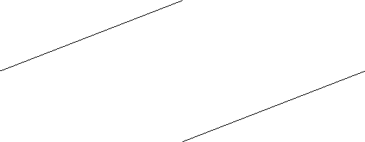

Phase-shift a wave/table to its rightmost zero point.

*Arguments*:

- *Wave/Table* (**Wave/Table**): Input waveform or table of waveforms.

*Output*: **Wave/Table**

### Bit [Amount, Wave/Table]

<small>Example: `Graph Bit(Val 0 1) Sin1`</small>

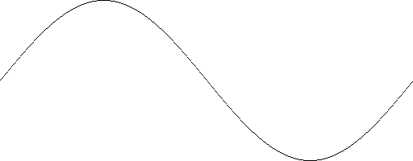

Bitcrush a wave/table.

*Arguments*:

- *Amount* (**Value**): 0-1, Bit depth; 0 = 16 bits, 1 = 1 bit.
- *Wave/Table* (**Wave/Table**): Input waveform or table of waveforms.

*Output*: **Wave/Table**

### Rev [Wave/Table]

<small>Example: `Graph Rev Pul 1 0.2`</small>

Reverse a wave/table left-to-right.

*Arguments*:

- *Wave/Table* (**Wave/Table**): Input waveform or table of waveforms.

*Output*: **Wave/Table**

### Inv [Wave/Table]

<small>Example: `Graph Inv Pul 1 0.2`</small>

Invert a wave/table top-to-bottom.

*Arguments*:

- *Wave/Table* (**Wave/Table**): Input waveform or table of waveforms.

*Output*: **Wave/Table**

### Mir [Wave/Table]

<small>Example: `Graph Mir Saw3`</small>

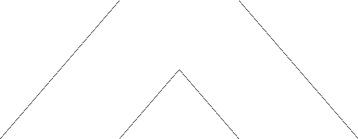

Mirror the left half of a wave/table into the right half.

*Arguments*:

- *Wave/Table* (**Wave/Table**): Input waveform or table of waveforms.

*Output*: **Wave/Table**

### Fad [Amount, Wave/Table]

<small>Example: `Graph Fad0.2 Saw1`</small>

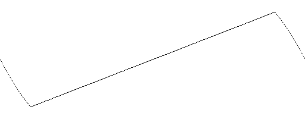

Fade the start & end of a wave/table from zero.

*Arguments*:

- *Amount* (**Value**): ≥0, Fade time; 0 = no fade, 0.5 = fade in & out for half the wave each.
- *Wave/Table* (**Wave/Table**): Input waveform or table of waveforms.

*Output*: **Wave/Table**

### Crs [Amount, Start Wave/Table, End Wave/Table]

<small>Example: `Graph Crs(Val 0 1) Saw2 Sin3`</small>

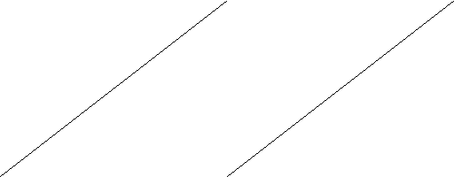

Crossfade between two waves/tables.

*Arguments*:

- *Amount* (**Value**): 0-1, Crossfade amount; 0 = 100% Start Wave/Table, 1 = 100% End Wave/Table, 0.5 = 50% blend of each.
- *Start Wave/Table* (**Wave/Table**): First input waveform or table of waveforms.
- *End Wave/Table* (**Wave/Table**): First input waveform or table of waveforms.

*Output*: **Wave/Table**

### Str [To, From, Wave/Table]

<small>Example: `Graph Str(Val 0.25 1) 0.25 Tri1`</small>

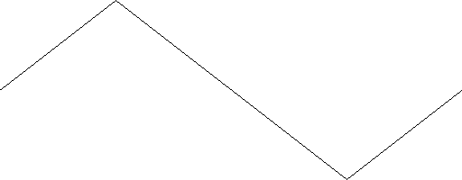

Stretch a wave/table from one point to another.

*Arguments*:

- *To* (**Value**): 0-1, Transformed stretch point; 0 = beginning, 1 = end, 0.5 = middle.
- *From* (**Value**): 0-1, Initial stretch point; 0 = beginning, 1 = end, 0.5 = middle.
- *Wave/Table* (**Wave/Table**): Input waveform or table of waveforms.

*Output*: **Wave/Table**

### Shf [Amount, Wave/Table]

<small>Example: `Graph Shf(Val ¯0.5 0.5) Amp0.5 Sin2`</small>

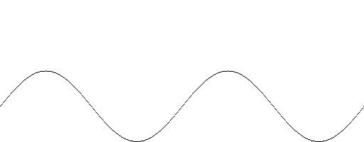

Shift a wave/table vertically.

*Arguments*:

- *Amount* (**Value**): Vertical shift; 0 = no shift, 1 = upward shift (half of full wave height), ¯1 = downward shift (half of full wave height).
- *Wave/Table* (**Wave/Table**): Input waveform or table of waveforms.

*Output*: **Wave/Table**

### Slc [Amount, Wave/Table]

<small>Example: `Graph Slc(Val 1 0.25) Sin1`</small>

Slice a wave/table from the beginning to a given point.

*Arguments*:

- *Amount* (**Value**): >0, End point of slice; 1 = no change, 0.5 = slice in half.
- *Wave/Table* (**Wave/Table**): Input waveform or table of waveforms.

*Output*: **Wave/Table**

### Spd [Octaves, Wave/Table]

<small>Example: `Graph Spd(Val 1 3) Sin1`</small>

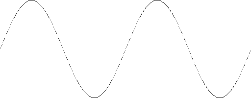

Speed a wave/table up or down in octaves.

*Arguments*:

- *Octaves* (**Value**): >0, Speedup/slowdown amount; 0 = no change, 1 = speed up one octave, ¯1 = slow down one octave.
- *Wave/Table* (**Wave/Table**): Input waveform or table of waveforms.

*Output*: **Wave/Table**

### Spl [Amount, Wave/Table 1, Wave/Table 2]

<small>Example: `Graph Spl(Val 0 1) Sin1 Tri1`</small>

Splice the beginning of one wave with the end of another wave.

*Arguments*:

- *Amount* (**Value**): 0-1, Splice point, 0 = 100% wave/table 1, 1 = 100% wave/table 2, 0.5 = 50% split.
- *Wave/Table 1* (**Wave/Table**): Beginning waveform or table of waveforms.
- *Wave/Table 2* (**Wave/Table**): Ending waveform or table of waveforms.

*Output*: **Wave/Table**

### Clp [Wave/Table]

<small>Example: `Graph Amp0.8 Clp Amp(Val 1 2) Sin1`</small>

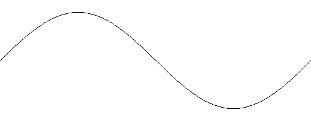

Hard-clip a wave/table.

*Arguments*:

- *Wave/Table* (**Wave/Table**): Input waveform or table of waveforms.

*Output*: **Wave/Table**

### Cls [Exponent, Wave/Table]

<small>Example: `Graph Amp0.8 Cls3 Amp(Val 1 2) Sin1`</small>

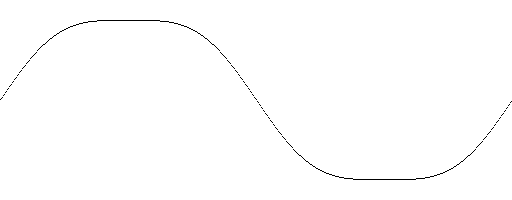

Soft-clip a wave/table.

*Output*: **Wave/Table**

### Wrp [Wave/Table]

<small>Example: `Graph Amp0.8 Wrp Amp(Val 1 2) Sin1`</small>

Wrap the clipping parts of a wave/table to the other side.

*Arguments*:

- *Wave/Table* (**Wave/Table**): Input waveform or table of waveforms.

*Output*: **Wave/Table**

### Fld [Wave/Table]

<small>Example: `Graph Amp0.8 Fld Amp(Val 1 2) Sin1`</small>

Fold the clipping parts of a wave/table backwards.

*Arguments*:

- *Wave/Table* (**Wave/Table**): Input waveform or table of waveforms.

*Output*: **Wave/Table**

### Sat [Gain, Wave/Table]

<small>Example: `Graph Amp0.8 Sat(Val 1 2) Sin1`</small>

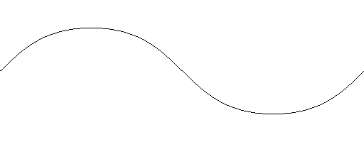

Apply tanh saturation to a wave/table.

*Arguments*:

- *Gain* (**Value**): Gain amplitude; 0 = silence, 1 = no change in gain.
- *Wave/Table* (**Wave/Table**): Input waveform or table of waveforms.

*Output*: **Wave/Table**

### Fuz [Gain, Shift, Wave/Table]

<small>Example: `Graph Amp0.8 Fuz (Val 1 2) 0.5 Sin1`</small>

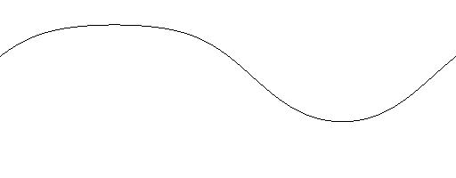

Apply tanh fuzz to a wave/table.

*Arguments*:

- *Gain* (**Value**): Gain amplitude; 0 = silence, 1 = no change in gain.
- *Shift* (**Value**): Vertical shift; 0 = no shift, 1 = upward shift (half of full wave height), ¯1 = downward shift (half of full wave height).
- *Wave/Table* (**Wave/Table**): Input waveform or table of waveforms.

*Output*: **Wave/Table**

### Rct [Wave/Table]

<small>Example: `Graph Rct Sin1`</small>

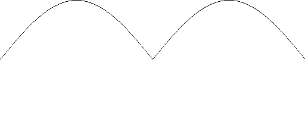

Rectify a wave/table (invert negative values).

*Arguments*:

- *Wave/Table* (**Wave/Table**): Input waveform or table of waveforms.

*Output*: **Wave/Table**

### AM [Amplitude, Modulator, Carrier]

<small>Example: `Graph Amp0.8 AM(Val 0 1) Sin4 Sin1`</small>

Amplitude-modulate a wave/table with another wave/table.

*Arguments*:

- *Amplitude* (**Value**): Modulation amount; 0 = no modulation, 1 = full-wave modulation.
- *Modulator* (**Wave/Table**): Modulator waveform or table of waveforms.
- *Carrier* (**Wave/Table**): Carrier waveform or table of waveforms.

*Output*: **Wave/Table**

### RM [Modulator, Carrier]

<small>Example: `Graph RM Sin2 Sin7`</small>

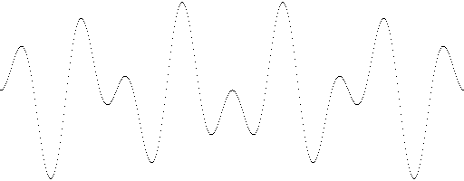

Ring-modulate a wave/table with another wave/table.

*Arguments*:

- *Modulator* (**Wave/Table**): Modulator waveform or table of waveforms.
- *Carrier* (**Wave/Table**): Carrier waveform or table of waveforms.

*Output*: **Wave/Table**

### FM [Amplitude, Modulator, Carrier]

<small>Example: `Graph FM(Val 0 1) Sin3 Sin1`</small>

Frequency-modulate a wave/table with another wave/table.

*Arguments*:

- *Amplitude* (**Value**): Modulation amount; 0 = no modulation, 1 = full-phase modulation.
- *Modulator* (**Wave/Table**): Modulator waveform or table of waveforms.
- *Carrier* (**Wave/Table**): Carrier waveform or table of waveforms.

*Output*: **Wave/Table**

### Cnv [Impulse(s), Wave/Table]

<small>Example: `Graph Cnv (ILPS 3) Sqr1`</small>

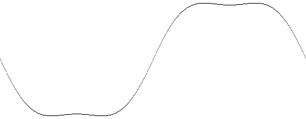

Convolve a wave/table with an impulse response.

*Arguments*:

- *Impulse(s)* (**Impulse(s)**): Impulse response or table of impulse responses.
- *Wave/Table* (**Wave/Table**): Input waveform or table of waveforms.

*Output*: **Wave/Table**

### Phr [Amount, Wave/Table]

<small>Example: `Graph Phr0.2 Saw1`</small>

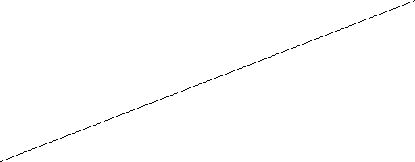

Randomize the phases of a wave/table's harmonics.

*Arguments*:

- *Amount* (**Value**): 0-1: Randomization amount; 0 = no randomization, 1 = full randomization.
- *Wave/Table* (**Wave/Table**): Input waveform or table of waveforms.

*Output*: **Wave/Table**

### Hwf [Amount, Filter Wave/Table, Source Wave/Table]

<small>Example: `Graph Hwf(Val 0 1) Saw3 Sqr1`</small>

Filter a wave/table using another wave/table's harmonics.

*Arguments*:

- *Amount* (**Value**): 0-1: Filter amount; 0 = no filtering, 1 = full filtering.
- *Filter Wave/Table* (**Wave/Table**): Filter waveform or table of waveforms.
- *Source Wave/Table* (**Wave/Table**): Source waveform or table of waveforms.

*Output*: **Wave/Table**

### Dwn [Amount, Wave/Table]

<small>Example: `Graph Dwn(Val 0 1) Sin1`</small>

Downsample a wave/table.

*Arguments*:

- *Amount* (**Value**): 0-1, Downsample rate; 0 = 2048 samples, 1 = 2 samples.
- *Wave/Table* (**Wave/Table**): Input waveform or table of waveforms.

*Output*: **Wave/Table**

### LP [Harmonic, Wave/Table]

<small>Example: `Graph LP(Val 0 10) Amp0.8 Sqr1`</small>

Apply a window-adjusted sinc low-pass filter to a wave/table.

*Arguments*:

- *Harmonic* (**Value**): ≥0, Cutoff, in harmonic frequency.
- *Wave/Table* (**Wave/Table**): Input waveform or table of waveforms.

*Output*: **Wave/Table**

### HP [Harmonic, Wave/Table]

<small>Example: `Graph HP(Val 0 10) Amp0.8 Sqr1`</small>

Apply a window-adjusted sinc high-pass filter to a wave/table.

*Arguments*:

- *Harmonic* (**Value**): ≥0, Cutoff, in harmonic frequency.
- *Wave/Table* (**Wave/Table**): Input waveform or table of waveforms.

*Output*: **Wave/Table**

### LPS [Harmonic, Wave/Table]

<small>Example: `Graph LPS(Val 0 10) Amp0.8 Sqr1`</small>

Apply a sinc low-pass filter to a wave/table.

*Arguments*:

- *Harmonic* (**Value**): ≥0, Cutoff, in harmonic frequency.
- *Wave/Table* (**Wave/Table**): Input waveform or table of waveforms.

*Output*: **Wave/Table**

### HPS [Harmonic, Wave/Table]

<small>Example: `Graph HPS(Val 0 10) Amp0.8 Sqr1`</small>

Apply a sinc high-pass filter to a wave/table.

*Arguments*:

- *Harmonic* (**Value**): ≥0, Cutoff, in harmonic frequency.
- *Wave/Table* (**Wave/Table**): Input waveform or table of waveforms.

*Output*: **Wave/Table**

### LPW [Harmonic, Window, Wave/Table]

<small>Example: `Graph LPW(Val 0 10) 2 Amp0.8 Sqr1`</small>

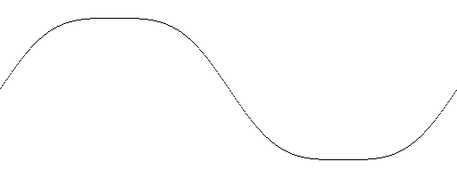

Apply a windowed-sinc low-pass filter to a wave/table.

*Arguments*:

- *Harmonic* (**Value**): ≥0, Cutoff, in harmonic frequency.
- *Window* (**Value**) ≥0, Window size, in harmonic length.
- *Wave/Table* (**Wave/Table**): Input waveform or table of waveforms.

*Output*: **Wave/Table**

### HPW [Harmonic, Window, Wave/Table]

<small>Example: `Graph HPW(Val 0 10) 2 Amp0.8 Sqr1`</small>

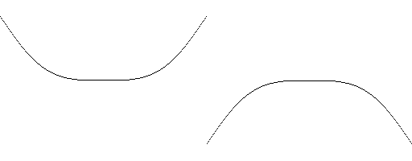

Apply a windowed-sinc high-pass filter to a wave/table.

*Arguments*:

- *Harmonic* (**Value**): ≥0, Cutoff, in harmonic frequency.
- *Window* (**Value**) ≥0, Window size, in harmonic length.
- *Wave/Table* (**Wave/Table**): Input waveform or table of waveforms.

*Output*: **Wave/Table**

### LPP [Harmonic, Wave/Table]

<small>Example: `Graph LPP(Val 0 10) Amp0.8 Sqr1`</small>

Apply a pulse low-pass filter to a wave/table.

*Arguments*:

- *Harmonic* (**Value**): ≥0, Cutoff, in harmonic frequency.
- *Wave/Table* (**Wave/Table**): Input waveform or table of waveforms.

*Output*: **Wave/Table**

### HPP [Harmonic, Wave/Table]

<small>Example: `Graph HPP(Val 0 10) Amp0.8 Sqr1`</small>

Apply a pulse high-pass filter to a wave/table.

*Arguments*:

- *Harmonic* (**Value**): ≥0, Cutoff, in harmonic frequency.
- *Wave/Table* (**Wave/Table**): Input waveform or table of waveforms.

*Output*: **Wave/Table**

### LPE [Harmonic, Wave/Table]

<small>Example: `Graph LPE(Val 0 10) Amp0.8 Sqr1`</small>

Apply an exponential low-pass filter to a wave/table.

*Arguments*:

- *Harmonic* (**Value**): ≥0, Cutoff, in harmonic frequency.
- *Wave/Table* (**Wave/Table**): Input waveform or table of waveforms.

*Output*: **Wave/Table**

### HPE [Harmonic, Wave/Table]

<small>Example: `Graph HPE(Val 0 10) Amp0.8 Sqr1`</small>

Apply an exponential high-pass filter to a wave/table.

*Arguments*:

- *Harmonic* (**Value**): ≥0, Cutoff, in harmonic frequency.
- *Wave/Table* (**Wave/Table**): Input waveform or table of waveforms.

*Output*: **Wave/Table**

## Table operations

Operations (effects/transformations) on entire tables. Unlike the *wave operations*, these only take **Number**s as arguments (not **Range**s), and always output **Table**s (not **Waveform**s).

### TMax [Wave/Table]

<small>Example: `Graph TMax Amp(Val 0.7 0.2) Sin1`</small>

Maximize a table by peaks. Each wave in a table is maximized depending on the peaks of the rest of the table.

*Arguments*:

- *Wave/Table* (**Wave/Table**): Input waveform or table of waveforms.

*Output*: **Table**

### TCtp [Wave/Table]

<small>Example: `Graph TCtp Shf(Val 0.5 0) Amp0.5 Sin1`</small>

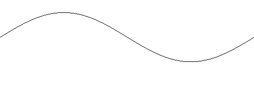

Center a table by peaks. Each wave in a table is centered depending on the peaks of the rest of the table.

*Arguments*:

- *Wave/Table* (**Wave/Table**): Input waveform or table of waveforms.

*Output*: **Table**

### TCtm [Wave/Table]

<small>Example: `Graph TCtm Amp0.4 Pul 2 (Val 0 0.5)`</small>

Center a table by mean. Each wave in a table is centered depending on the mean of the rest of the table.

*Arguments*:

- *Wave/Table* (**Wave/Table**): Input waveform or table of waveforms.

*Output*: **Table**

### TCmb [Amplitude, Harmonic, Wave/Table]

<small>Example: `Graph TCmb 0.5 7 Amp0.7 Saw1`</small>

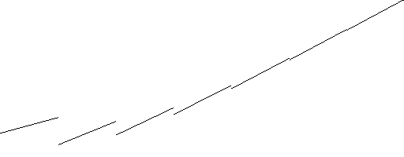

Apply a feed-back comb filter to a table.

*Arguments*:

- *Amplitude* (**Number**): Feedback amplitude.
- *Harmonic* (**Number**): >0, Feedback delay, in harmonic length.
- *Wave/Table* (**Wave/Table**): Input waveform or table of waveforms.

*Output*: **Table**

### TCmf [Amplitude, Harmonic, Wave/Table]

<small>Example: `Graph TCmf 0.5 7 Amp0.7 Saw1`</small>

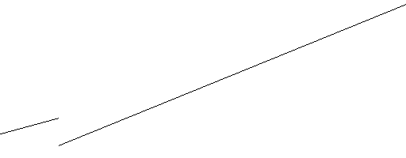

Apply a feed-forward comb filter to a table.

- *Amplitude* (**Number**): Feedforward amplitude.
- *Harmonic* (**Number**): >0, Feedforward delay, in harmonic length.
- *Wave/Table* (**Wave/Table**): Input waveform or table of waveforms.

*Output*: **Table**